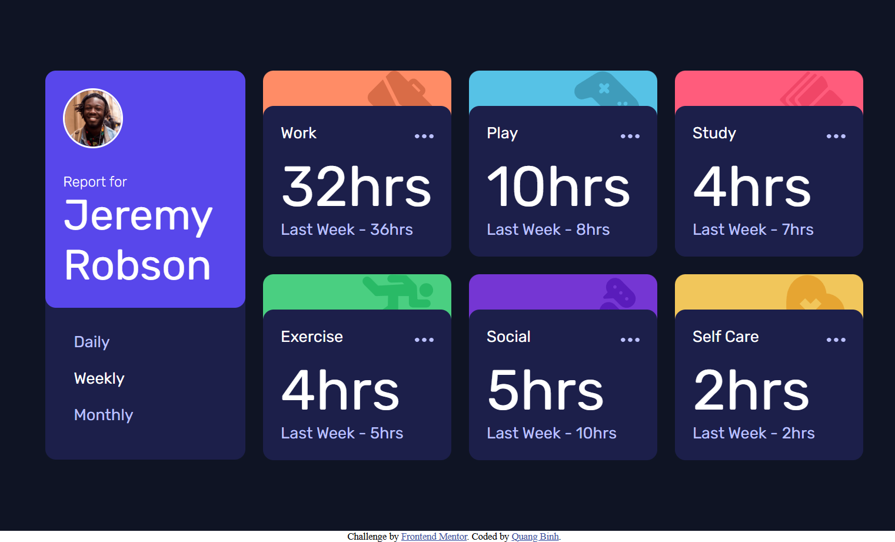

# Frontend Mentor - Time tracking dashboard solution

This is a solution to the [Time tracking dashboard challenge on Frontend Mentor](https://www.frontendmentor.io/challenges/time-tracking-dashboard-UIQ7167Jw). Frontend Mentor challenges help you improve your coding skills by building realistic projects. 

## Table of contents

- [Overview](#overview)
  - [The challenge](#the-challenge)
  - [Screenshot](#screenshot)
  - [Links](#links)
- [My process](#my-process)
  - [Built with](#built-with)
  - [What I learned](#what-i-learned)
  - [Continued development](#continued-development)
  - [AI Collaboration](#ai-collaboration)
- [Author](#author)
- [Acknowledgments](#acknowledgments)

## Overview

### The challenge

Users should be able to:

- View the optimal layout for the site depending on their device's screen size
- See hover states for all interactive elements on the page
- Switch between viewing Daily, Weekly, and Monthly stats

### Screenshot

### Links

- Solution URL: [Add solution URL here](https://github.com/nqbinh98/time-tracking-dashboard)
- Live Site URL: [Add live site URL here](https://nqbinh98.github.io/time-tracking-dashboard/)

## My process

### Built with

- Semantic HTML5 markup
- CSS custom properties
- Flexbox
- CSS Grid
- Mobile-first workflow
- Asynchronous JavaScript (Fetch API, Async/Await)

### What I learned
- I deepened my understanding of the Fetch API and async/await to handle dynamic JSON data updates, moving away from callback-based logic.
- I learned to manage application state effectively, ensuring that UI updates are synchronized with the user's selection (Daily, Weekly, Monthly).

- I improved my grasp of CSS Grid for responsive layouts and adopted best practices for accessibility, such as using sr-only classes and relative units (rem) for better scalability.

### Continued development
- I aim to integrate a 'loading state' (skeleton screens) to improve the perceived performance during data fetching.
- I plan to refactor the project into a modular architecture using ES6 modules to make the code even more maintainable and scalable.
- I want to explore persistent data storage using localStorage so that the user's last selection is remembered upon page refresh.

### AI Collaboration
- Collaborated with AI to refine the asynchronous logic, ensuring robust error handling with try...catch blocks.
- Received guidance on implementing accessibility standards (semantic HTML, relative units) and best practices for CSS architecture (specificity, logical properties).

## Author

- Website - [nqbinh98](https://github.com/nqbinh98)
- Frontend Mentor - [@nqbinh98](https://www.frontendmentor.io/profile/nqbinh98)

## Acknowledgments
I would like to extend my gratitude to the Frontend Mentor community for providing such an insightful challenge, which allowed me to practice and refine my skills in asynchronous JavaScript and responsive web design. I also appreciate the collaborative guidance from AI, which helped me better understand accessibility standards and robust error-handling practices
